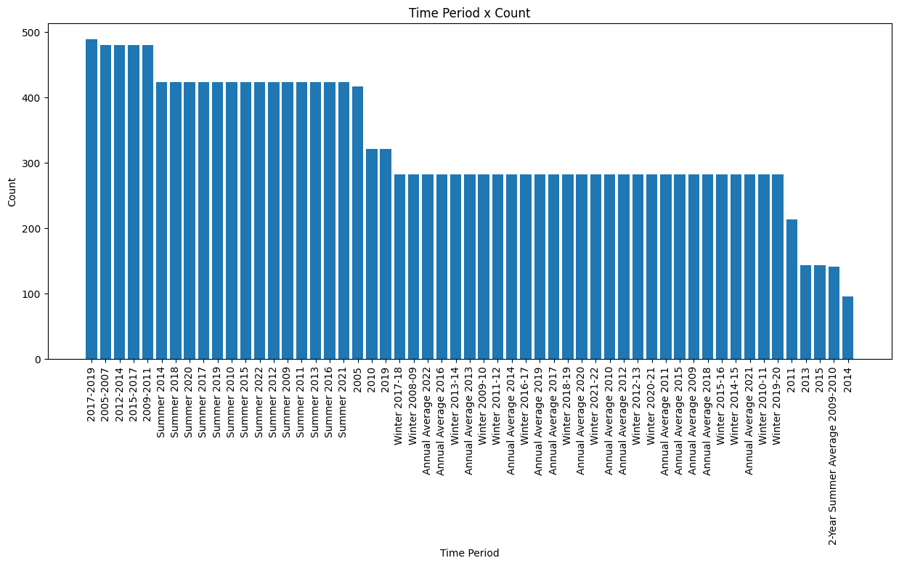

<h1 align="center" id="title">Gráfico com Dados - World Bank</h1>

O objetivo deste projeto é apresentar uma base de dados detalhada sobre a qualidade do ar. Nele serão abordados os países onde ocorrem os maiores problemas de qualidade do ar identificados os gases responsáveis por essas condições analisados os períodos em que a qualidade do ar é mais baixa e exibidos gráficos que facilitam a compreensão dessas informações.

<h2>Project Screenshots:</h2>

É possível perceber que os níveis de dióxido de carbono são muito altos nos países onde a presença de partículas finas, produzidas pela combustão, é significativa. Essas partículas não são saudáveis, pois podem ser inaladas, prejudicando a saúde dos seres humanos.

  

Pelo gráfico acima, é possível perceber que o período de 2007 a 2019 foi marcado por um crescimento industrial significativo, acompanhado pelo aumento da população mundial. Além disso, nota-se que a qualidade do ar no verão tende a ser pior, especialmente durante períodos de seca e calor excessivo. Esses fatores contribuem para o aumento da poluição, um problema agravado pelo aquecimento global.

  
<h2>💻 Built with</h2>

Technologies used in the project:

*   Pandas
*   Jupyter Notebook
*   Matplotlib
*   Python
